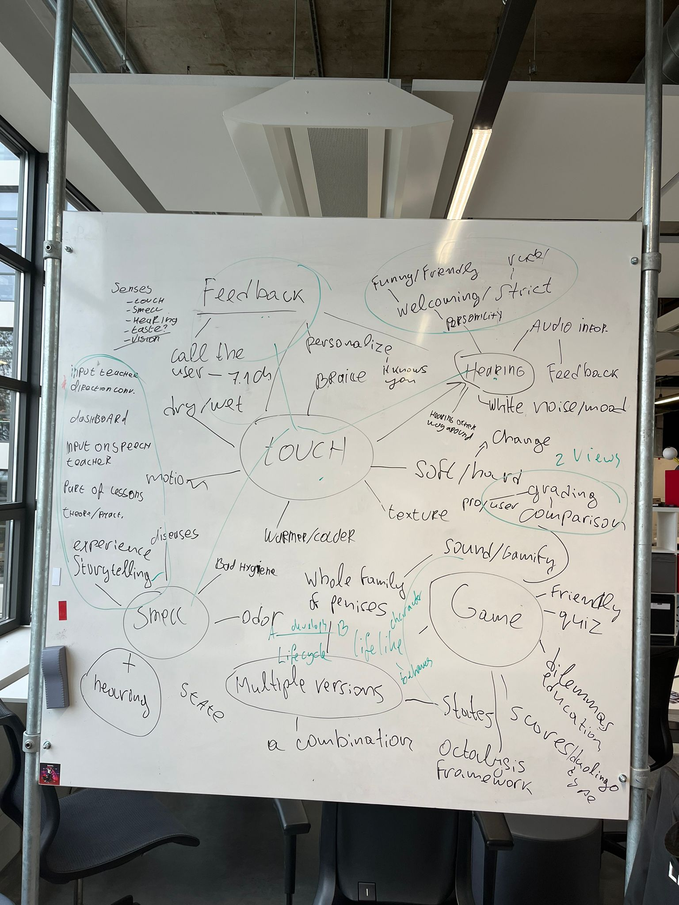

# Brainstorm Session (Ideation)

## Why?

After defining our goal, problem statement and main research question we went all in with a brainstorm session.
We wanted to gather as many ideas as possbile based on the research question (How can we incorporate the different senses in order to teach born blind teenagers at the age of 10 to 15 about the human body?.)

## How?

We excluded the senses vision (because the target group is blind) and taste (because this can become weird). After that we just started writing down ideas and grouping these together.

After a while we didn't have any ideas left. Ruud told us about a method to search random pictures online and contect these with the context of the project.
Then try to come up with new ideas based on what you see on the picture, this method really helped us to gather some more ideas.

## Result

## Conclusion

Based on this brainstorm session we came up with the idea to make a 3d model which the blind people can touch. When they touch the model it provides feedback in the sense of voice. We also had some ideas of implementing a quiz and asking the model questions.
