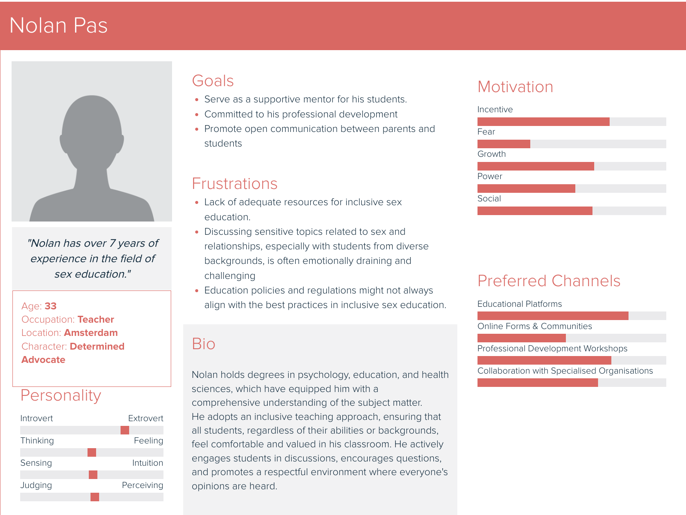
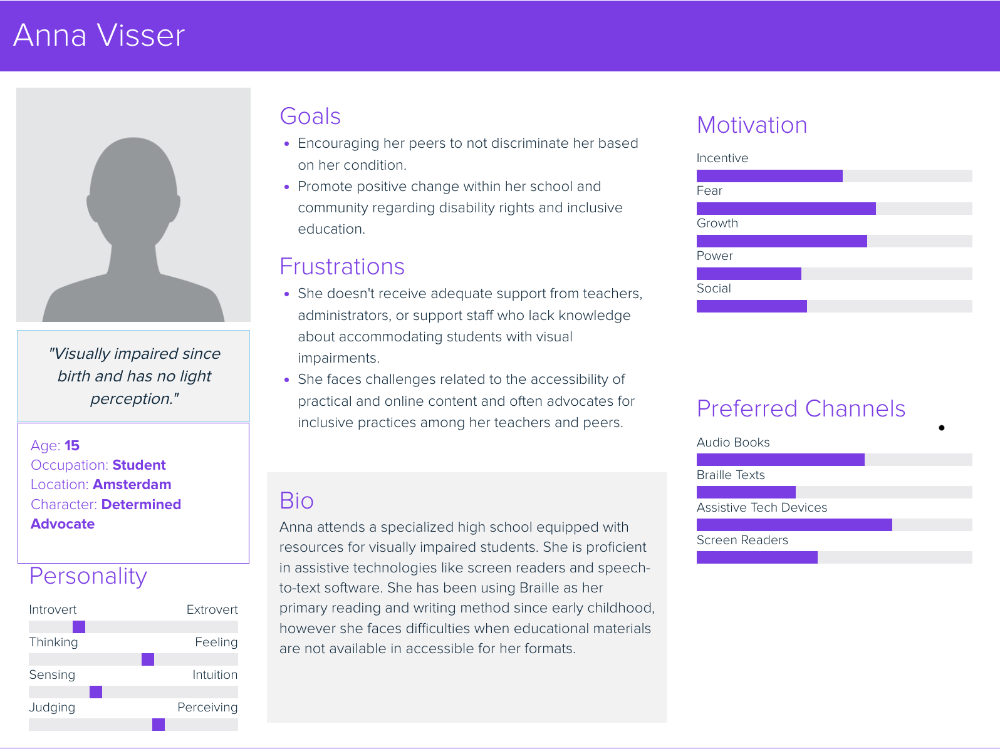

# Personas

## Why?

Because the bigger picture of the project is in a classroom environment, we made 2 person's. One of the theacher and one for the blind teenager.

## How?

First we made the persona for the teacher, who gives sexual education. After that we took our goal we defined after the emphatize fase and made a persona for the blind individual.

## Result

### Persona teacher (Nolan Pas)

### Persona blind teenager (Anne Visser)

## Conclusion

After we made the persona's we got a better understanding of our target group. We can also use these persona's for further research.
